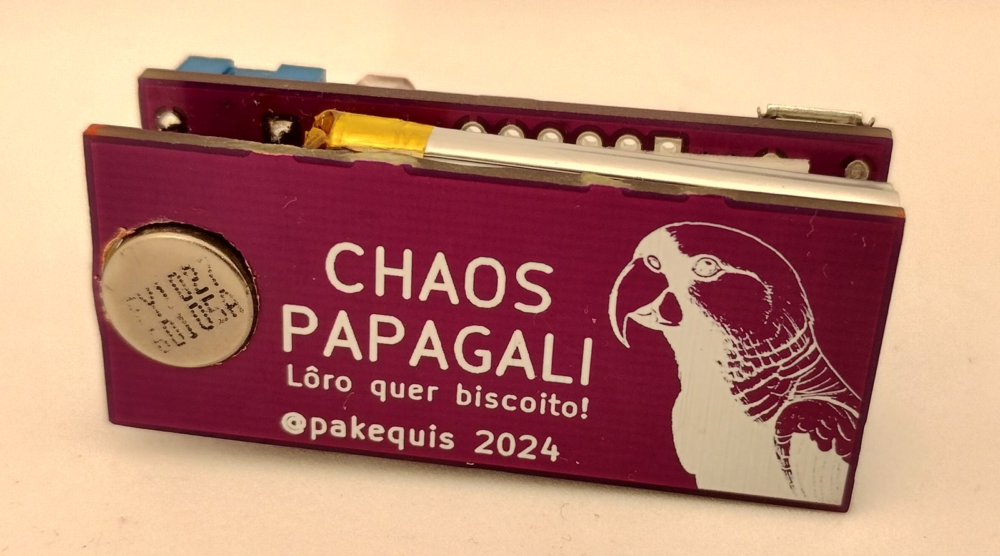
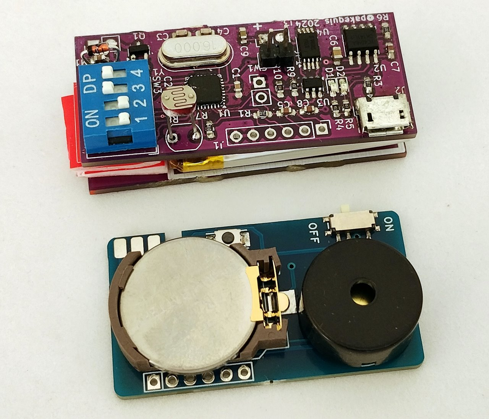
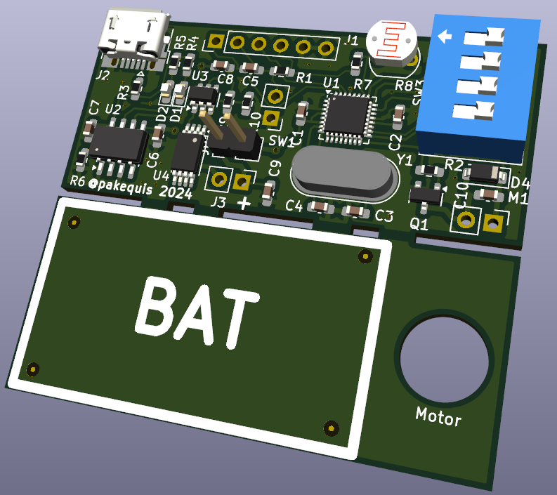
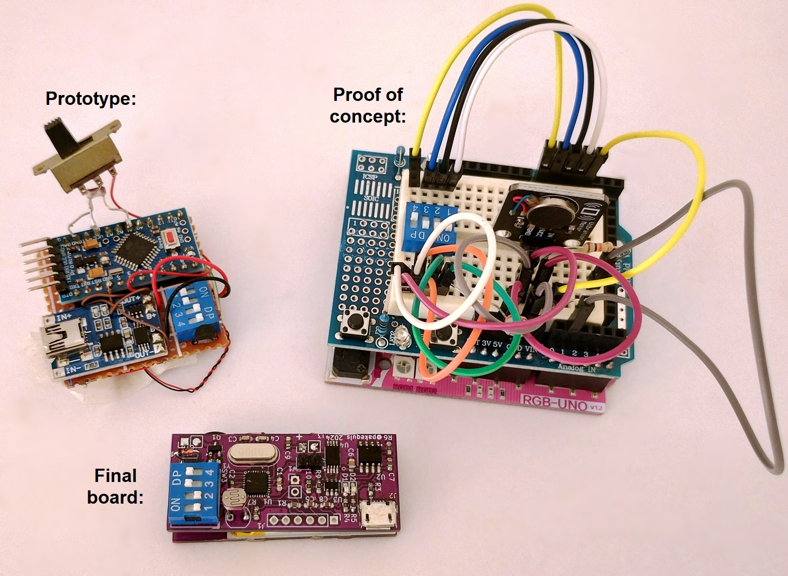
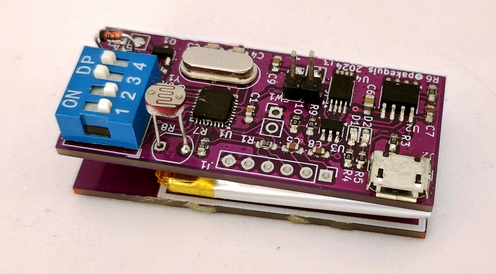

# **Chaos Papagali**

A slightly over-engineered, annoying device that imitates the vibration of a phone.

## About the project:

This project is an update of the classic electronic cricket circuit that we saw in old electronics magazines. It's a prank device aimed at annoying someone (especially my daughters and my wife). Today, there are devices like the [OpenKobold](https://github.com/Seitanas/OpenKobold) and the [Annoyng PCB](https://annoyingpcb.com/) that play random sounds, but none imitate the vibration of a phone. So, I created one that does.

Chaos Papagali is a little bigger (50 x 21 mm) than Annoyng PCB (44 x 24 mm):

In addition to being annoying with its random vibrations, the Chaos Papagali also has the function of only operating in the dark for maximum inconvenience.

## Demo video:

## Hardware:

The circuit is a mashup of an Arduino and a battery charger from [OSHWLab](https://oshwlab.com/Little_Arc/TP4056).

The boards were developed in kicad 8.0. There are two PCBs in one panel, one for the circuit and another for support the battery and motor. It is necessary to break the PCB in half during final assembly. The two boards are stacked and secured with double sided tape over the battery.

The project had three phases:

1. Proof of concept assembled with an RGBDuino and a prototyping shield.
2. Prototype using an Arduino Pro Mini and a battery charger module.
3. Final circuit on a two-PCB stack.

The device is powered by a 400 mAh battery and operates with a current consumption of approximately 500 µA in low power mode. This configuration ensures several days of use between charges, depending on the operating interval and the type of motor employed.

The ATMEGA328 microcontroller runs well at 16MHz on battery, although it would be better to lower the frequency using an 8MHz crystal.

## Firmware:
There are two sketches (.ino), one with the main program and another with the functions. 

The firmware goes into low power mode and triggers the vibration motor at random intervals. 

The dip switch selection options:

Dip 1 and 2: Mode of vibration:
    00 = Phone call.
    01 = Phone alarm.
    10 = Phone notification.
    11 = Chaos mode (all modes above, at random).

Dip 3: Day or night function. With 0 the device works with light on the LDR. With 1 the device works only in the dark.

Dip 4: Time short or long. 0 = short time (1 to 10 minutes). 1 = Long time (10 to 60 minutes interval).

## Notes:
1. At first, I considered adding a buzzer to mimic the end-of-cycle sound found in some home appliances. I was able to replicate the beeps of my microwave, but I couldn't manage to imitate those of the washing machine. It seems that washing machine manufacturers opted for a more complex buzzer circuit for some reason.

In these machines, they implement a circuit with frequency and envelope outputs to play classical music (such as "Die Forelle," for example). Since it was taking a long time to develop this part, I decided to remove the buzzer from the project.

2. In some cases, it is necessary to secure the PCB to the surface with adhesive tape or by placing a weight on it; otherwise, it may 'walk' on the surface.

3. Image of a parrot (Papagali in Romanian) generated with AI, because I don't have the gift for drawing. The project name is a reference to that [song](https://www.youtube.com/watch?v=nYc09Xqy3hE) by the second greatest metal band in the world.

4. Is possible to make this with a couple of LM555? Maybe...

## Contact:
Feel free to reach out to me on social media: @pakequis in any of them...

You can also send me an email at pakequis (Gmail).